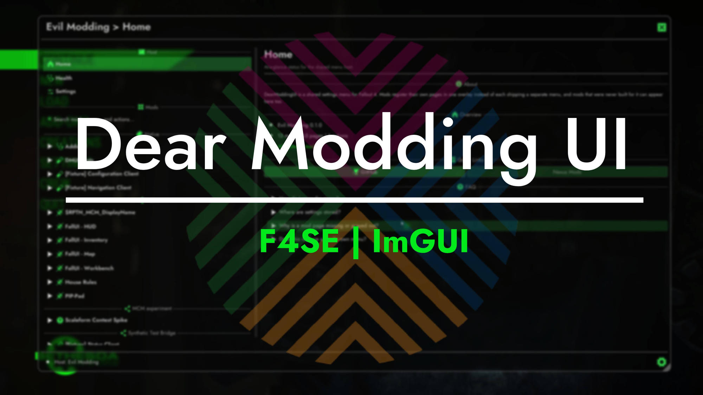

<div align="center">



# DearModdingUI

**Shared Dear ImGui settings host and overlay system for Fallout 4 mods.**

Mods register their settings pages and controls into one shared in-game menu.

<br>

[](https://github.com/Dear-Modding-FO4/DearModdingUI/actions/workflows/xmake.yml)
[](https://github.com/Dear-Modding-FO4/DearModdingUI/releases/latest)
[](LICENSE)

[](#requirements)
[](xmake.lua)
[](CONTRIBUTING.md#prerequisites)

<sub>[Requirements](#requirements) · [Features](#features) · [Installation](#installation) · [Configuration](#configuration) · [Menu Controls](#menu-controls) · [For Developers](#for-mod-developers) · [Contributing](#contributing) · [License](#license)</sub>

</div>

---

## Requirements

| Component | Requirement |
|---|---|
| **Fallout 4** | OG **1.10.163**, NG **1.10.984**, or AE **1.11.240**. One binary supports all three runtimes. |
| **[Fallout 4 Script Extender (F4SE)](https://f4se.silverlock.org/)** | Matching version for your game runtime. |
| **[Address Library for F4SE](https://www.nexusmods.com/fallout4/mods/47327)** | Matching database for your game runtime. |

---

## Features

| Capability | Details |
|---|---|
| **Unified menu** | A single in-game interface where participating mods present settings and status. |
| **Modern UI and theming** | Hardware-accelerated Dear ImGui rendering with custom styling, typography, and background blur. |
| **Flexible navigation** | Tree, two-pane, drill-down, and icon-rail sidebar browsing layouts with mod category grouping and live search. |
| **Native cursor** | Uses Fallout 4's menu cursor, with isolated ImGui and cursor ownership. |
| **Host-owned icons** | Consistent Phosphor icons with host-controlled automatic icon selection. |
| **Live health monitoring** | Real-time observation of renderer status, configuration persistence, input interception, and typography. |
| **Zero runtime link dependency** | Mod plugins interact via a versioned C ABI. Clients do not link against the host DLL or bundle Dear ImGui. |
| **Legacy MCM support** | An optional bridge converts existing MCM configurations into DearModdingUI pages automatically. |

---

## Installation

Install using your preferred mod manager (Mod Organizer 2, Vortex), or extract the archive into the Fallout 4 `Data` folder:

```text
Data\
└─ F4SE\Plugins\
   ├─ DearModdingUI.dll
   ├─ DearModdingUI.toml
   └─ DearModdingUI\ (fonts, shaders, imgui.ini)
```

To enable support for classic MCM-based mods, install the companion package:

```text
Data\
└─ F4SE\Plugins\
   └─ DearModdingUI-MCM.dll
```

Download the latest packages from the [Releases](https://github.com/Dear-Modding-FO4/DearModdingUI/releases/latest) page.
Use the `release` packages for normal play; the host `test` package includes the diagnostic client.
When upgrading, preserve `DearModdingUI.toml` and the generated `DearModdingUI\imgui.ini`
to retain your settings and layout.

---

## Configuration

Host settings are stored in `Data/F4SE/Plugins/DearModdingUI.toml`. Window state and layout are preserved in `Data/F4SE/Plugins/DearModdingUI/imgui.ini`.

```toml
[Additional]
# Hotkey to toggle the menu (End, Home, Insert, Delete, F1-F12)
sMenuToggleKey = "End"

# Sidebar presentation style (tree, twopane, drilldown, iconrail)
sMenuSidebarLayout = "tree"

# Appearance defaults
fMenuWindowOpacity = 0.75
bMenuBackgroundBlur = true
fMenuBackgroundBlurStrength = 0.50
```

Window background opacity defaults to **75%** and blur strength to **50%**.
Existing saved values are not replaced by new defaults; use the setting's Reset
control to restore its default. Appearance changes require Apply; sidebar layout
changes are saved immediately.

---

## Menu Controls

- **Toggle Menu**: Press **End** (or your configured key) to open and close the interface.
- **Dismiss Popups / Close**: Press **Escape** to cancel active edits, dismiss open dialogs, or close the menu.
- **Built-in Host Pages**:
  - **Home**: Overview of active mod registrations and system health.
  - **Health**: Diagnostic breakdown of host subsystems and per-client status.
  - **Settings**: Visual appearance, theme colors, and layout preferences.

| Sidebar layout | Behavior |
|---|---|
| **Tree** | Expand mods and categories inline. Single-page mods open directly without a redundant child entry. |
| **Two-pane** | Mods and the selected mod's pages sit side by side inside the sidebar, with independent scrolling and an adjustable divider. |
| **Drill-down** | Selecting a mod replaces the mod list with its pages; All Mods returns to the list. |
| **Icon rail** | A narrow, independently scrolling mod-icon column leaves the remaining sidebar width for pages. Hover an icon to see its name. |

Click an origin heading, such as Native or MCM, to collapse or expand its group
where headings are shown. Tree mod expansion markers are small and muted; they
appear on hover, keyboard focus, or while the mod is expanded.

Drag the sidebar/content divider to change the overall sidebar width.
Two-pane also lets you resize the Mods/Pages split. These widths are remembered
with the window layout.

---

## For Mod Developers

To integrate your F4SE plugin with DearModdingUI:

1. Consume the public API headers from the [DearModdingUI-API](https://github.com/Dear-Modding-FO4/DearModdingUI-API) repository (included automatically in the Dear Modding CommonLibF4 fork).
2. Discover `DearModdingUI.dll` at F4SE `kPostPostLoad` via `DMUI_GetAPI`.
3. Register your client descriptor and pages using the lightweight, header-only C++ wrapper (`<DearModdingUI/Client.h>`).
4. Draw controls using the stable `dmui::ui` namespace without compiling Dear ImGui into your plugin.

Clients using the older ImGui forwarding interface must migrate to `dmui::ui`
and rebuild. Automatic setting-group icons use the host's `resolveIconGlyph`
entry: clients adopt this API once, then later host vocabulary updates do not
require another client rebuild.

Refer to [`include/DearModdingUI/README.md`](include/DearModdingUI/README.md) and the [API documentation](https://github.com/Dear-Modding-FO4/DearModdingUI-API) for detailed integration guides.

## Project Generation (Optional)
If you use Visual Studio, run the following command:
```bat
xmake project -k vsxmake
```

> ***Note:*** *This will generate a `vsxmakeXXXX/` directory in the **project's root directory** using the latest version of Visual Studio installed on the system.*

**Alternatively**, if you do not use Visual Studio, you can generate a `compile_commands.json` file for use with a laguage server like clangd in any code editor that supports it, like vscode:
```bat
xmake project -k compile_commands
```

> ***Note:*** *You must have a language server extension installed to make use of this file. I recommend `clangd`. Do not have more than one installed at a time as they will conflict with each other. I also recommend installing the `xmake` extension if available to make building the project easier.*

## Notes

---

## Contributing

Contributions, bug reports, and enhancements are welcome.
For development environment setup, build instructions, test execution, standalone preview tools, and contract code generation, see [CONTRIBUTING.md](CONTRIBUTING.md).

---

## License

DearModdingUI is licensed under GPL-3.0. See [LICENSE](LICENSE). Third-party software notices and font licenses are detailed in [THIRD_PARTY_NOTICES.md](THIRD_PARTY_NOTICES.md).