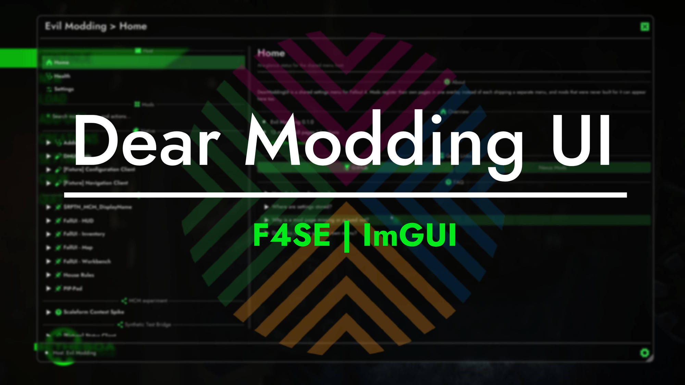



# DearModdingUI

**A shared Dear ImGui settings menu and overlay host for Fallout 4 mods.**

## Requirements

| Component | Requirement |
|---|---|
| **Fallout 4** | OG **1.10.163**, NG **1.10.984**, or AE **1.11.240**. One binary supports all three runtimes. |
| **[Fallout 4 Script Extender (F4SE)](https://f4se.silverlock.org/)** | Matching version for your game runtime. |
| **[Address Library for F4SE](https://www.nexusmods.com/fallout4/mods/47327)** | Matching database for your game runtime. |

## Installation and use

Install the core package from [Releases](https://github.com/Dear-Modding-FO4/DearModdingUI/releases/latest)
with Mod Organizer 2 or Vortex, or extract it into Fallout 4's `Data` folder.
Add the optional **DearModdingUI-MCM** companion package for legacy MCM menus.

Press **End** to toggle the menu. **Escape** cancels an active edit, dismisses a
dialog, or closes the menu. The built-in Settings page controls appearance and
sidebar layout; Health provides host and client diagnostics.

| File under `Data\F4SE\Plugins\` | Purpose |
|---|---|
| `DearModdingUI.toml` | Host settings, including the menu toggle key. |
| `DearModdingUI\imgui.ini` | Saved window state and layout. |

Preserve both files when upgrading.

## Architecture

| Component | Responsibility |
|---|---|
| **Host** | Shared menu, navigation, controls, rendering, input, fonts, and icons. |
| **Client API** | Versioned C ABI with a header-only C++ wrapper for mods. |
| **MCM bridge** | Optional companion that shows legacy MCM menus in the host. |
| **Diagnostics** | Desktop preview and in-game test client for development. |

## Mod integration

Mods integrate through the [public API headers](https://github.com/Dear-Modding-FO4/DearModdingUI-API),
also included in the Dear Modding CommonLibF4 fork. The [client guide](include/DearModdingUI/README.md)
covers registration, settings, overlays, and compatibility.

## Development

See [CONTRIBUTING.md](CONTRIBUTING.md) for prerequisites, building, testing, and packaging.

## License

Licensed under [GPL-3.0](LICENSE). See [THIRD_PARTY_NOTICES.md](THIRD_PARTY_NOTICES.md)
for dependency and font licenses.